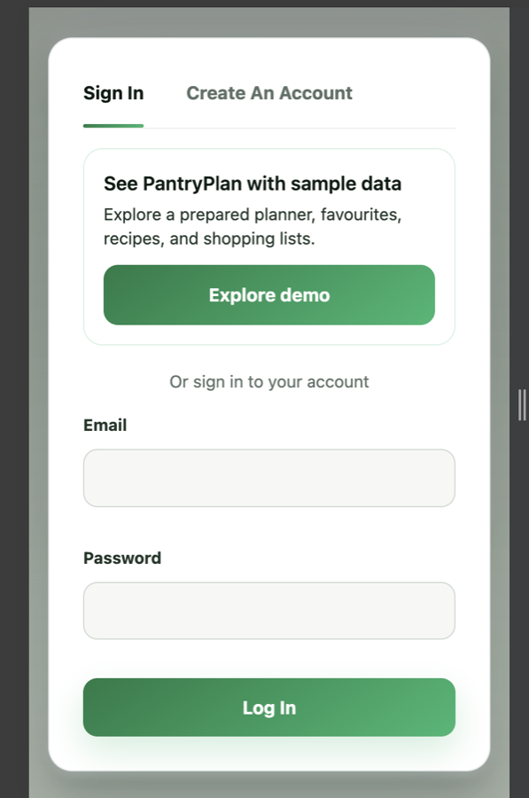
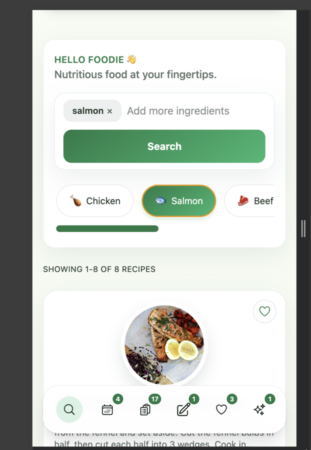
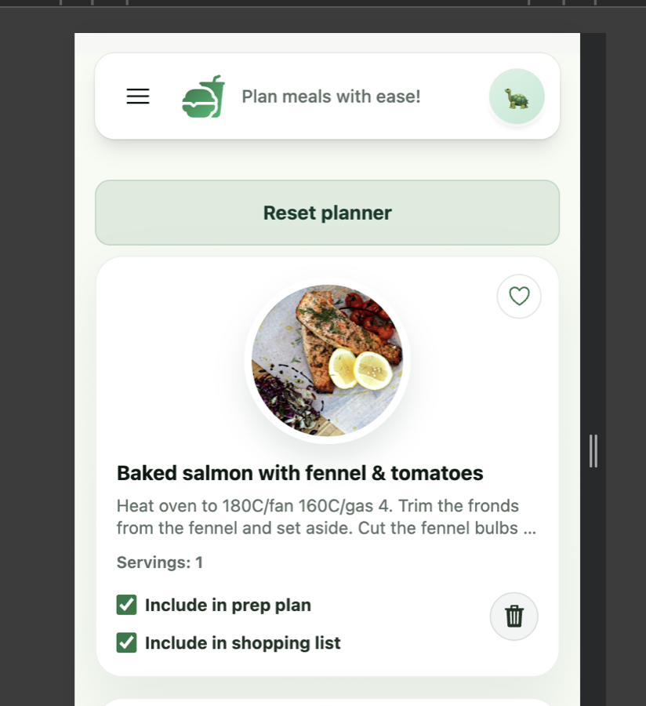
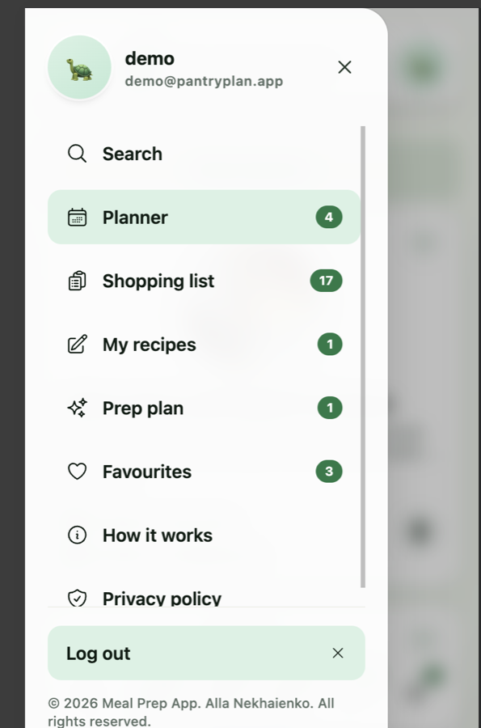

# PantryPlan

A full‑stack meal planning app with ingredient‑based recipe search, personal planning, prep plans, and shopping lists.

**[Open the live demo](https://allas-meal-prep-app.netlify.app/)** — choose
**Explore demo** to enter a seeded account without creating a profile.

<table>
  <tr>
    <td></td>
    <td></td>
  </tr>
  <tr>
    <td></td>
    <td></td>
  </tr>
</table>

**Highlights**
- Ingredient‑based recipe search powered by TheMealDB.
- Planner for organizing meals and servings.
- Prep plan generation using OpenAI (optional but required to generate plans).
- Shopping lists per recipe plus a manual list with editing tools.
- Custom recipes, favourites, and saved prep plans.
- Cookie‑based authentication with basic password rules.
- One-click access to a populated demo account.
- Responsive PWA experience with offline asset caching.

**Tech Stack**
- Web: React 19, Vite, React Router, Apollo Client, Tailwind.
- API: Node/Express, GraphQL Yoga, MongoDB.
- External services: TheMealDB API, OpenAI for prep plan generation.

## Architecture

```text
Browser
  └── Netlify CDN (React/Vite PWA)
        └── /graphql proxy
              └── Vercel Function (Express + GraphQL Yoga)
                    ├── MongoDB Atlas
                    ├── TheMealDB
                    ├── OpenAI Responses API
                    └── Vercel Blob (optional recipe images)
```

Netlify serves the static frontend and proxies GraphQL requests to Vercel. This
keeps browser requests same-origin for cookie authentication while allowing the
API to scale independently. MongoDB counters provide rate limits that remain
consistent across serverless instances.

## Engineering Decisions

- GraphQL gives the feature-rich client one typed API boundary and lets pages
  request only the recipe, planner, and shopping-list fields they need.
- HTTP-only JWT cookies keep authentication tokens out of browser storage.
- OpenAI Structured Outputs are validated again with Zod before results enter
  application state.
- Secondary routes are lazy-loaded to reduce work on the initial page visit.
- Uploaded images are resized in the browser. Production can store new images
  in Vercel Blob while local development and existing records remain compatible.
- AI generation is protected by a MongoDB-backed per-user daily allowance.

**Project Structure**
- `api/` GraphQL server, resolvers, repos, adapters.
- `web/` React client.
- `docker-compose.yml` MongoDB container for local dev.
- `Architecture.md`, `ERD.md`, `Validation.md` for deeper docs.

## Local Setup

1. Start MongoDB
```
cd meal-prep-app
docker compose up -d
```

2. API environment variables (`meal-prep-app/api/.env`)
```
MONGO_URI=mongodb://localhost:27017/meal-prep
JWT_SECRET=change-me
CORS_ORIGIN=http://localhost:5173
JWT_ISSUER=meal-prep-api
JWT_AUDIENCE=meal-prep-web
OPENAI_API_KEY=optional-but-required-for-prep-plans
DEMO_EMAIL=optional-email-for-one-click-demo-access
AI_DAILY_LIMIT=optional-default-5
BLOB_READ_WRITE_TOKEN=optional-created-by-vercel-blob
PORT=4000
```
Notes:
- `CORS_ORIGIN` is required for cookie auth and must match the exact web origin.
  You can pass multiple origins as a comma-separated list.
- `JWT_ISSUER` and `JWT_AUDIENCE` are optional and default to the values above.
- `DEMO_EMAIL` enables one-click access to an existing seeded demo account. It
  does not require exposing the account password to the browser.
- `AI_DAILY_LIMIT` limits prep-plan generations per user in a 24-hour window.
- `BLOB_READ_WRITE_TOKEN` is added automatically when a Vercel Blob store is
  connected. Without it, compressed image data remains MongoDB-compatible.

3. Web environment variables (`meal-prep-app/web/.env`)
```
VITE_API_URL=http://localhost:4000/graphql
```
Note: there is no dev proxy configured, so `VITE_API_URL` is required for local
development unless you serve the web app from the same origin as the API.

4. Install dependencies
```
cd meal-prep-app/api
npm install

cd ../web
npm install
```

5. Run the API and web app
```
cd meal-prep-app/api
npm run dev

cd ../web
npm run dev
```

API will be available at `http://localhost:4000/graphql`.

## Scripts

**API**
- `npm run dev` – run GraphQL server with nodemon.
- `npm run build` – compile TypeScript.
- `npm run start` – run compiled server.
- `npm run test` – run focused resolver and validation tests.

**Web**
- `npm run dev` – start Vite dev server.
- `npm run build` – production build.
- `npm run preview` – preview build.
- `npm run test` – run vitest.
- `npm run lint` – lint web code.

## Data & Auth Notes

- Authentication uses signed cookies and JWT.
- Password rules: minimum 8 characters, at least 1 number and 1 special character.
- Prep plan generation requires `OPENAI_API_KEY`.
- Production rate limits use expiring MongoDB counters rather than function-local memory.

## Deployment

- Frontend: Netlify (`web/`)
- API: Vercel (`api/`)
- Database: MongoDB Atlas
- Image storage: optional public Vercel Blob store

The Netlify redirect in `web/public/_redirects` forwards `/graphql` to the
Vercel API. Secrets are configured through provider environment variables and
are never committed.

## Useful Docs

- `Architecture.md` – system overview.
- `ERD.md` – database schema.
- `Validation.md` – business rules and validations.
