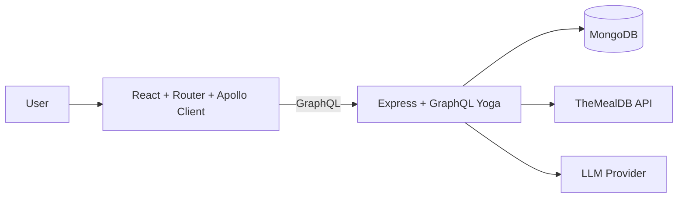
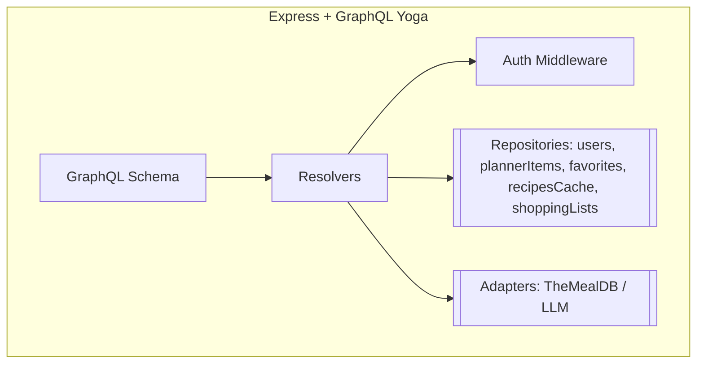
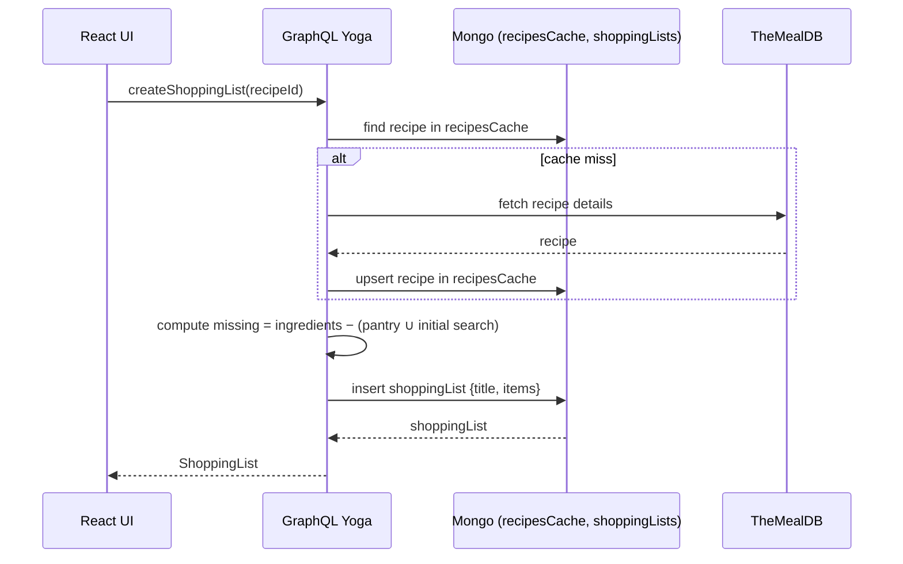
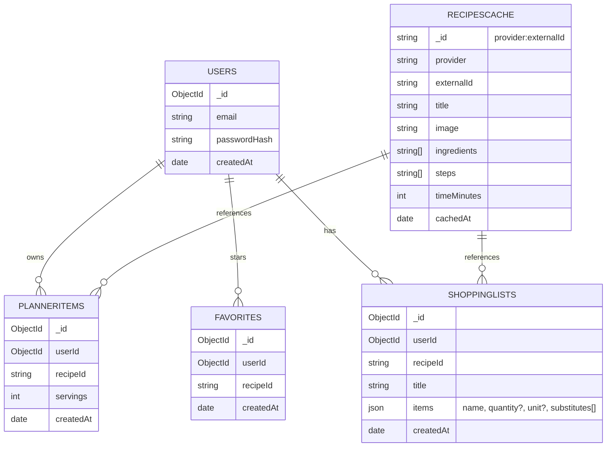

### Meal prep App Specifications

**Core Types (conceptual)**

- `Recipe { id, title, image, steps[], ingredients[], source, timeMinutes, callories }`
- `PlannerItem { id, recipeId, servings, createdAt }`
- `PrepStep { order, description, appliesToRecipeIds[] }`
- `ShoppingList { id, recipeId, title, items: [ShoppingItem!]!, createdAt }`
- `ShoppingItem { name, quantity, unit, substitutes[] }`

**Queries**

- `searchRecipes(ingredients: [String!]!, page: Int): RecipeSearchResult!`
- `recipe(id: ID!): Recipe`
- `plannerItems: [PlannerItem!]!`
- `favorites: [Recipe!]!`
- `shoppingLists: [ShoppingList!]!` ← feeds the floating modal

**Mutations**

- `addToPlanner(items: [PlannerItemInput!]!): [PlannerItem!]!`
- `removeFromPlanner(recipeId: ID!): Boolean!`
- `clearPlanner: Boolean!`
- `toggleFavorite(recipeId: ID!): Boolean!`
- `generatePrepPlan(recipeIds: [ID!]!): [PrepStep!]!`
- `generateShoppingList(recipeIds: [ID!]!, pantry: [String!]!): [ShoppingItem!]!`
- **(per-recipe lists):**
    - `createShoppingList(recipeId: ID!): ShoppingList!` *(server computes “missing” = recipe.ingredients − pantry/initial query)*
    - `updateShoppingList(listId: ID!, items: [ShoppingItemInput!]!): ShoppingList!`
    - `deleteShoppingList(listId: ID!): Boolean!`
- `signup(email, password)`, `login(email, password)`, `logout`

### Tech in use

- DB: MongoDB (native Node driver, no Mongoose)
- Recipe API: TheMealDB
- LLM: for prep-plan merging & substitutions

